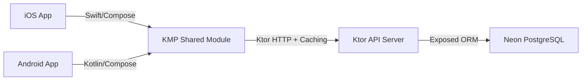

# TradePulse: Architecture & Directory Structure Blueprint

This blueprint describes the structural and architectural specifications of the **TradePulse** client (Kotlin Multiplatform) and backend (Ktor API) projects. Copy and paste this file to Antigravity or any LLM in the future to regenerate projects following the exact same stack, folder layout, design patterns, and database caching patterns.

---

## 1. High-Level System Overview
The system follows a B2B marketplace/trading model with real-time bidding, order management, and moderation:



* **Client**: Built with **Compose Multiplatform (KMP)** for Android & iOS. Operates **Offline-First** with local SQLite database caching and live bid tick loops. Uses the **MVI (Model-View-Intent)** presentation pattern.
* **Backend**: Built with **Ktor Server (JVM)**. Uses **JetBrains Exposed ORM** connected to a serverless **Neon PostgreSQL** database. Stores media/images persistently in the database as Base64 strings.

---

## 2. Directory Structure Blueprint

### A. Mobile Client Project (KMP)
```bash
├── gradle/
│   └── libs.versions.toml   # Dependency versions catalog (Compose, Ktor, SQLDelight, Koin)
├── androidApp/              # Android-specific entry point
│   ├── build.gradle.kts     # Namespace: com.yeshuwahane.tradepulse.android
│   └── src/main/kotlin/com/yeshuwahane/tradepulse/MainActivity.kt
├── iosApp/                  # iOS Swift App Wrapper
│   └── iosApp/iOSApp.swift  # Calls the shared Compose UI entry point
└── shared/                  # Core KMP module containing all shared logic
    ├── build.gradle.kts     # Configuration for Kotlin, SQLDelight, & CocoaPods/Framework
    └── src/
        ├── commonMain/
        │   ├── kotlin/com/yeshuwahane/tradepulse/
        │   │   ├── Platform.kt     # Expect/Actual definitions (e.g. current time, platform details)
        │   │   ├── App.kt          # Root Compose Multiplatform App component & Koin starter
        │   │   ├── theme/          # HSL Material3 dynamic themes & Typography definitions
        │   │   ├── data/
        │   │   │   ├── db/         # Dao interfaces and SQLDelight mappings
        │   │   │   ├── model/      # API Data Transfer Objects (DTOs)
        │   │   │   ├── repository/ # Repository implementations (implements offline-first caching)
        │   │   │   └── utils/      #safeApiCall wrapper (handles non-2xx Ktor parsing)
        │   │   ├── domain/
        │   │   │   ├── model/      # UI-agnostic Domain models (Product, User)
        │   │   │   ├── repository/ # Domain repository interface contracts
        │   │   │   └── usecase/    # Reusable business logic (PlaceBidUseCase, LoginUseCase)
        │   │   ├── di/
        │   │   │   └── CommonModule.kt # Koin definitions (Repositories, UseCases, ViewModels)
        │   │   └── presentation/
        │   │       ├── components/ # Reusable UI components (ProductImage, Shimmer spinner)
        │   │       ├── login/      # Login/Signup screen and LoginViewModel (MVI)
        │   │       ├── marketplace/# Customer marketplace screen (Bidding/Buyout grid)
        │   │       ├── supplier/   # Supplier dashboard (Tabbed listings, edit forms, shimmer loading)
        │   │       └── admin/      # Admin overview (Approvals, user directory deletion/creation)
        │   └── sqldelight/com/yeshuwahane/tradepulse/data/db/
        │       └── TradePulseDb.sq # SQLite schemas and local queries
        ├── androidMain/
        │   └── kotlin/com/yeshuwahane/tradepulse/
        │       └── data/db/PlatformDatabaseDriver.android.kt # Android SQLite Driver implementation
        └── iosMain/
            └── kotlin/com/yeshuwahane/tradepulse/
                ├── data/db/PlatformDatabaseDriver.ios.kt     # iOS SQLite Native Driver implementation
                └── presentation/components/ImagePicker.ios.kt # UIImage selection via PHPickerViewController
```

### B. Backend API Project (Ktor)
```bash
├── Dockerfile               # Production container image configuration
├── build.gradle.kts         # Ktor plugins, Exposed dependencies, and ShadowJar builder
├── settings.gradle.kts      # rootProject.name = "tradepulse_api"
└── src/
    └── main/kotlin/com/tradepulse/
        ├── Application.kt   # Server entry point
        ├── plugins/
        │   ├── Database.kt  # Neon PostgreSQL connection setup, Exposed migration, & data seeding
        │   ├── Routing.kt   # Root endpoint registration
        │   ├── Serialization.kt # JSON encoding configuration
        │   └── Monitoring.kt # HTTP call logging metrics
        ├── models/          # Exposed table model entities & serialization contracts
        │   ├── User.kt
        │   ├── Product.kt
        │   └── BidRequest.kt
        └── routes/          # REST Endpoint business logic
            ├── AuthRouting.kt # User login, registration, deletion, and directory editing
            └── ProductRouting.kt # Product retrieval, approval actions, & Base64 image uploads/streaming
```

---

## 3. Core Architecture Patterns & Code Snippets

### A. Client Offline-First Caching Strategy (Repository Pattern)
We fetch data from the remote backend, update the local SQLite database cache, and emit data from local cache as the single source of truth:
```kotlin
override suspend fun getProducts(forceRefresh: Boolean): DataResource<List<Product>> {
    if (forceRefresh) {
        val remoteResource = apiCall<List<ProductDto>> { httpClient.get("/api/products") }
        if (remoteResource.isSuccess() && remoteResource.data != null) {
            dao.clear()
            dao.insertAll(remoteResource.data.map { it.toDomain() })
        }
    }
    return DataResource.success(dao.getAll().map { it.toDomain() })
}
```

### B. MVI Pattern (Model-View-Intent)
We structure UI state logic using a state flow and dispatching clean intent definitions:
```kotlin
// UI State Contract
data class DetailUiState(
    val productResource: DataResource<Product> = DataResource.loading(),
    val currentTimeMillis: Long = 0L,
    val bidderName: String = "",
    val bidAmount: String = "",
    val isPlacingBid: Boolean = false
)

// Intent Interface
sealed interface DetailIntent {
    data class LoadProduct(val id: String) : DetailIntent
    data class SubmitBid(val productId: String) : DetailIntent
    data class TickTimer(val time: Long) : DetailIntent
}
```

### C. Live Countdown Timer Loop
The live remaining time ticker is launched as a coroutine bound to the product ID lifecycle:
```kotlin
val remaining = product.auctionEndTimeMillis - state.currentTimeMillis
if (product.isAuction) {
    LaunchedEffect(productId) {
        while (true) {
            viewModel.onIntent(DetailIntent.TickTimer(getCurrentTimeMillis()))
            delay(1000)
        }
    }
}
```

### D. Safe API Wrapper (Custom Ktor Error Handling)
Ensures Ktor backend exception payloads do not crash the client due to deserialization issues:
```kotlin
suspend fun <T> apiCall(call: suspend () -> HttpResponse): DataResource<T> {
    return try {
        val response = call()
        if (response.status.isSuccess()) {
            val body = response.body<T>()
            DataResource.success(body)
        } else {
            val errorText = response.bodyAsText()
            DataResource.error(Exception(errorText))
        }
    } catch (e: ResponseException) {
        val errorText = e.response.bodyAsText()
        DataResource.error(Exception(errorText))
    } catch (e: Exception) {
        DataResource.error(e)
    }
}
```

### E. Persistent Database Image Streaming (Ktor Server)
To prevent images from being lost during ephemeral container refreshes on cloud hosting, files are stored as Base64 strings in Postgres and streamed to the client as raw binary bytes:
```kotlin
// 1. Storage Upload
val base64Content = Base64.getEncoder().encodeToString(imageBytes)
val newImageId = UUID.randomUUID().toString()
transaction {
    ImagesTable.insert {
        it[id] = newImageId
        it[content] = base64Content
    }
}

// 2. Retrieval & Streaming
get("/api/images/{id}") {
    val id = call.parameters["id"]
    val imageRecord = transaction {
        ImagesTable.select { ImagesTable.id eq id }.map { it[ImagesTable.content] }.firstOrNull()
    }
    if (imageRecord != null) {
        val rawBytes = Base64.getDecoder().decode(imageRecord)
        call.respondBytes(rawBytes, ContentType.Image.PNG)
    } else {
        call.respond(HttpStatusCode.NotFound)
    }
}
```

---

## 4. Key Libraries Used
* **Compose Multiplatform**: Declarative UI engine shared across Android & iOS.
* **Voyager**: Component navigation framework supporting stateful `ScreenModel` lifecycles.
* **Ktor Client/Server**: Async network requests engine utilizing Kotlin Coroutines.
* **SQLDelight**: Local SQL database schema compiler and Type-safe SQLite builder.
* **Koin**: Lightweight Dependency Injection library managing instances.
* **JetBrains Exposed**: Kotlin SQL library providing DSL/DAO layouts for Postgres operations.
